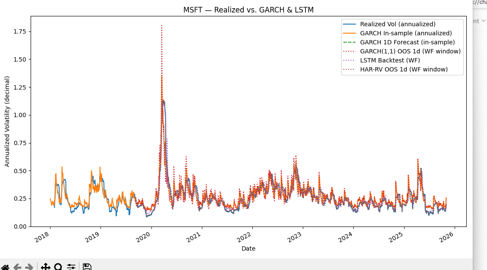

# Volatility Forecasting (GARCH, HAR-RV, LSTM)

This project compares **econometric** and **deep learning** approaches for forecasting financial market volatility.

Implemented models:
- **GARCH(1,1)**
- **HAR-RV**
- **LSTM (PyTorch, walk-forward retraining)**

---

###  Features
- Yahoo Finance data ingestion via `yfinance`
- Rolling realized volatility computation
- Out-of-sample walk-forward validation
- Diebold–Mariano statistical comparison
- CSV outputs for reproducibility

---

###  Example Output
Plots and metrics are saved for each ticker (AAPL, MSFT).  
Models are compared via **RMSE**, **MAE**, **MAPE**, **R²**, and **Diebold–Mariano** tests.

Below are sample volatility forecasts showing realized volatility versus GARCH and LSTM predictions.

#### Apple (AAPL)

#### Microsoft (MSFT)

---

###  File Structure
VOL-FORECASTING/
│
├── VolatilityForecasting.py          # Main pipeline
│
├── vol_accuracy_comparison.csv       # Model performance summary
├── dm_tests.csv                      # Diebold–Mariano test results
│
├── AAPL_vol_outputs.csv              # AAPL volatility outputs
├── MSFT_vol_outputs.csv              # MSFT volatility outputs
│
├── AAPL_garch_params.csv             # AAPL GARCH(1,1) parameters
├── MSFT_garch_params.csv             # MSFT GARCH(1,1) parameters
│
├── images/
│   ├── AAPL_vol_forecast.png         # AAPL realized vs forecasted volatility
│   └── MSFT_vol_forecast.png         # MSFT realized vs forecasted volatility
│
├── .gitignore
└── README.md

###  Requirements
- Python ≥ 3.9  
- PyTorch  
- ARCH  
- scikit-learn  
- yfinance  
- matplotlib  

---

##  Methodology Overview

### 1. GARCH(1,1) Model
The conditional variance evolves as:

**σₜ² = ω + αεₜ₋₁² + βσₜ₋₁²**

where:  
- **σₜ²** — conditional variance (volatility²)  
- **ω** — long-run mean variance  
- **α** — reaction to recent shocks  
- **β** — persistence of past volatility  

---

### 2. HAR-RV Model
The Heterogeneous AutoRegressive model for realized volatility:

**RVₜ = β₀ + β₁RVₜ₋₁ + β₂RV̄ₜ₋₅:ₜ₋₁ + β₃RV̄ₜ₋₂₂:ₜ₋₁ + εₜ**

This model captures multi-horizon volatility components (daily, weekly, monthly).

---

### 3. LSTM Model
A recurrent neural network using Long Short-Term Memory cells to capture nonlinear temporal dependencies in volatility:

**hₜ = LSTM(RVₜ₋₁, RVₜ₋₂, …, RVₜ₋ₚ)**

Hidden states are trained via **Backpropagation Through Time (BPTT)**, and the model is **retrained in a walk-forward fashion** to simulate live forecasting conditions.

---

### 4. Diebold–Mariano Test
Used to compare forecast accuracy between two models *A* and *B*:

**DM = 𝑑̄ / √((2π f̂_d(0)) / T)**  

where:  
- *dₜ = L(eA,t) − L(eB,t)*  
- *L* is squared error loss  

A **negative DM statistic** implies Model A is more accurate.

---

##  Sample Results (2018–2025)

| Ticker | Model | RMSE | MAE | MAPE (%) | R² |
|:-------|:------|-----:|----:|---------:|----:|
| **AAPL** | GARCH(1,1) (in-sample) | 0.0583 | 0.0438 | 17.88 | 0.81 |
| **AAPL** | LSTM (WF) | 0.0345 | 0.0238 | 8.79 | 0.94 |
| **AAPL** | HAR-RV (WF) | **0.0212** | **0.0113** | **4.12** | **0.98** |
| **MSFT** | GARCH(1,1) (in-sample) | 0.0538 | 0.0398 | 17.34 | 0.82 |
| **MSFT** | LSTM (WF) | 0.0344 | 0.0229 | 9.56 | 0.93 |
| **MSFT** | HAR-RV (WF) | **0.0188** | **0.0102** | **4.01** | **0.98** |

**Key Takeaway:**  
Both **LSTM** and **HAR-RV** models achieve significant accuracy improvements over GARCH baselines — reducing RMSE by over **50%** and explaining **93–98%** of realized volatility variance.

---

##  Diebold–Mariano Test Results (Forecast Accuracy Comparison)

| Ticker | Comparison | DM Stat | p-value | Interpretation |
|:-------|:------------|--------:|--------:|:----------------|
| AAPL | LSTM WF vs GARCH OOS | -9.54 | < 0.001 | LSTM significantly outperforms GARCH |
| AAPL | LSTM WF vs HAR-RV OOS | +12.13 | < 0.001 | HAR-RV significantly outperforms LSTM |
| AAPL | HAR-RV OOS vs GARCH OOS | -10.95 | < 0.001 | HAR-RV significantly outperforms GARCH |
| MSFT | LSTM WF vs GARCH OOS | -6.95 | < 0.001 | LSTM significantly outperforms GARCH |
| MSFT | LSTM WF vs HAR-RV OOS | +8.67 | < 0.001 | HAR-RV significantly outperforms LSTM |
| MSFT | HAR-RV OOS vs GARCH OOS | -7.95 | < 0.001 | HAR-RV significantly outperforms GARCH |

---

##  Future Work
- Extend models to include **EGARCH** and **GJR-GARCH** (asymmetric volatility)  
- Combine HAR and LSTM architectures for hybrid modeling  
- Apply framework across asset classes (FX, bonds, crypto)  
- Integrate forecasts into **option pricing** and **risk management** workflows  

---

## 📜 License
**MIT License © Kevin Wood**
